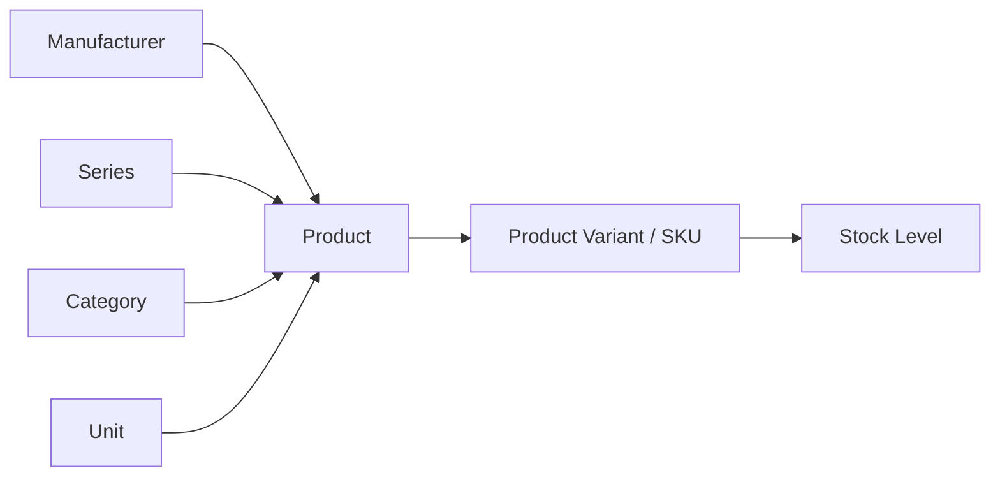
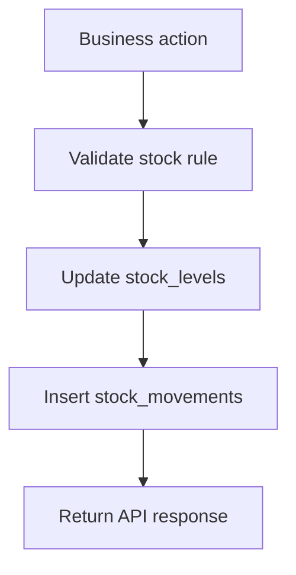
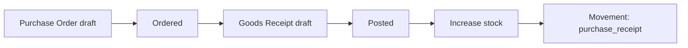
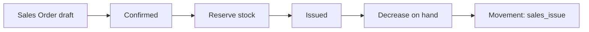
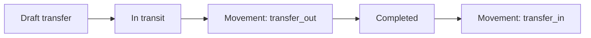
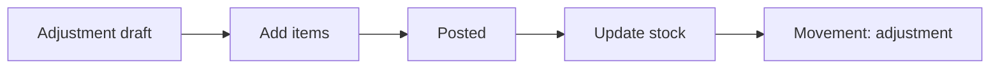

# Lộ Trình Phát Triển Kho Model Kit

Tài liệu này dùng để trả lời câu hỏi: nên code chức năng nào trước, bảng nào trước, luồng nào sau cho dự án quản lý kho mô hình nhựa/model kit bằng Laravel API + Vue.

## Nguyên Tắc Chung

- Code từ bảng nền đến bảng phụ thuộc. Bảng nào được bảng khác tham chiếu thì nên làm trước.
- Mỗi phase nên có migration, model, request validation, controller, route, seeder và test riêng.
- Mỗi lần làm một cụm nghiệp vụ nhỏ, push lên nhánh riêng để dễ review/rollback.
- Tồn kho không nên làm CRUD đơn thuần. Tồn kho nên thay đổi thông qua nghiệp vụ: nhập hàng, xuất hàng, chuyển kho, điều chỉnh, kiểm kê.
- Mỗi thao tác làm thay đổi số lượng tồn nên ghi vào `stock_movements`.

## Trạng Thái Hiện Tại

Bạn đã có nền tảng tốt để đi tiếp:

- Login/logout bằng API token.
- CRUD users.
- CRUD units.
- CRUD product categories.
- Product API và test đang được bổ sung theo domain model kit.

Vì vậy hướng đi hợp lý tiếp theo là hoàn thiện catalog model kit trước, sau đó mới làm kho và luồng tồn.

## Thứ Tự Làm Tổng Quan

| Thứ tự | Cụm chức năng          | Bảng chính                                                                   | Lý do làm ở bước này                          |
| ------ | ---------------------- | ---------------------------------------------------------------------------- | --------------------------------------------- |
| 1      | Master data nhỏ        | `units`, `product_categories`, `model_kit_manufacturers`, `model_kit_series` | Product cần những bảng này trước              |
| 2      | Product catalog        | `products`, `product_variants`                                               | Mọi nghiệp vụ kho đều đi theo SKU/variant     |
| 3      | Warehouse master       | `warehouses`, `storage_locations`                                            | Stock cần biết hàng nằm ở kho nào, vị trí nào |
| 4      | Inventory core         | `stock_levels`, `stock_movements`                                            | Nền tảng tồn kho và lịch sử biến động         |
| 5      | Purchasing             | `suppliers`, `purchase_orders`, `goods_receipts`                             | Luồng nhập hàng làm tăng tồn                  |
| 6      | Sales/Issue            | `customers`, `sales_orders`                                                  | Luồng xuất hàng làm giảm tồn                  |
| 7      | Stock transfer         | `stock_transfers`                                                            | Chuyển hàng giữa kho/vị trí                   |
| 8      | Adjustment & counting  | `stock_adjustments`, `inventory_counts`                                      | Sửa lệch tồn, kiểm kê thực tế                 |
| 9      | Reports & notification | `notifications`, `audit_logs`                                                | Làm sau khi đã có dữ liệu nghiệp vụ           |

## Phase 1 - Master Data

### Nên code

- CRUD Unit.
- CRUD Product Category.
- CRUD Model Kit Manufacturer.
- CRUD Model Kit Series.

### Bảng liên quan

- `units`
- `product_categories`
- `model_kit_manufacturers`
- `model_kit_series`

### API gợi ý

| Method | Endpoint                       | Ý nghĩa                     |
| ------ | ------------------------------ | --------------------------- |
| GET    | `/api/units`                   | Danh sách đơn vị tính       |
| GET    | `/api/product-categories`      | Danh sách danh mục          |
| GET    | `/api/model-kit-manufacturers` | Danh sách hãng sản xuất     |
| GET    | `/api/model-kit-series`        | Danh sách series/dòng model |

### Giải thích luồng

Manufacturer và Series nên làm trước Product vì mỗi model kit thường cần biết hãng sản xuất và dòng sản phẩm. Ví dụ `Bandai Spirits` là manufacturer, `Mobile Suit Gundam` là series. Product sẽ tham chiếu hai bảng này.

### Test nên có

- Route yêu cầu authentication.
- Tạo mới thành công.
- Validate required/unique.
- Sửa thành công.
- Xóa/soft delete nếu bảng có soft delete.

## Phase 2 - Product Catalog

### Nên code

- CRUD Product.
- CRUD Product Variant.
- Lọc/search product theo name, kit code, manufacturer, series, grade, scale, status.
- Lọc variant theo SKU, barcode, edition, box condition, item condition.

### Bảng liên quan

- `products`
- `product_variants`
- Phụ thuộc: `units`, `product_categories`, `model_kit_manufacturers`, `model_kit_series`

### Giải thích product và variant

`products` lưu thông tin chung của kit:

- Tên kit: `HGUC RX-78-2 Gundam Revive`
- Hãng: `Bandai Spirits`
- Series: `Mobile Suit Gundam`
- Grade: `HG`
- Scale: `1/144`
- Kit code, material, runner count, release date

`product_variants` lưu SKU thực tế trong kho:

- SKU bản standard.
- SKU limited edition.
- SKU hộp mới.
- SKU hộp móp.
- SKU preorder batch.
- Tình trạng manual/decal.

Một product có thể có nhiều variant. Tồn kho nên bám vào variant, không bám trực tiếp vào product.



### API gợi ý

| Method | Endpoint                | Ý nghĩa                           |
| ------ | ----------------------- | --------------------------------- |
| GET    | `/api/products`         | Danh sách product                 |
| POST   | `/api/products`         | Tạo product                       |
| GET    | `/api/products/{id}`    | Xem chi tiết product kèm relation |
| PUT    | `/api/products/{id}`    | Cập nhật product                  |
| DELETE | `/api/products/{id}`    | Xóa product                       |
| GET    | `/api/product-variants` | Danh sách SKU                     |
| POST   | `/api/product-variants` | Tạo SKU/variant                   |

### Vue nên làm

- Trang Product List: search, filter manufacturer/series/grade/scale/status.
- Trang Product Form: chọn category, unit, manufacturer, series.
- Trang Product Detail: hiển thị product + danh sách variants.
- Trang Variant Form: SKU, barcode, edition, box condition, item condition, giá nhập/giá bán.

## Phase 3 - Warehouse Master

### Nên code

- CRUD Warehouse.
- CRUD Storage Location.
- Gán manager cho warehouse.
- Lọc location theo warehouse.

### Bảng liên quan

- `warehouses`
- `storage_locations`
- Phụ thuộc: `users`

### Giải thích luồng

Warehouse là kho lớn, location là vị trí nhỏ trong kho. Ví dụ:

- Warehouse: `HCM01 - Kho Hồ Chí Minh`
- Location: `A-01-01`, `A-01-02`, `QC-01`

Khi nhập hàng hoặc chuyển hàng, mình cần biết hàng đi vào location nào. Vì vậy Warehouse/Location nên làm trước Inventory Core.

### Test nên có

- Không cho trùng `code`.
- Location không được trùng code trong cùng warehouse.
- Có thể trùng code nếu khác warehouse.
- Xóa warehouse cần cân nhắc nếu đã có stock.

## Phase 4 - Inventory Core

### Nên code

- Xem stock level theo warehouse/location/SKU.
- Tạo service cập nhật tồn kho.
- Ghi stock movement mỗi khi tồn thay đổi.
- API lịch sử movement theo SKU hoặc warehouse.

### Bảng liên quan

- `stock_levels`
- `stock_movements`
- Phụ thuộc: `warehouses`, `storage_locations`, `product_variants`

### Giải thích luồng

`stock_levels` là số tồn hiện tại.

`stock_movements` là lịch sử thay đổi tồn.

Không nên cho user sửa trực tiếp `quantity_on_hand` bằng form CRUD bình thường. Nếu sửa trực tiếp sẽ mất lịch sử. Nên tạo các method nghiệp vụ như:

- `increaseStock(...)`
- `decreaseStock(...)`
- `reserveStock(...)`
- `releaseReservedStock(...)`
- `moveStock(...)`

Mỗi method cập nhật `stock_levels` và tạo dòng `stock_movements`.



### Công thức cần nhớ

```text
quantity_available = quantity_on_hand - quantity_reserved
```

## Phase 5 - Purchasing / Nhập Hàng

### Nên code

- CRUD Supplier.
- Tạo Purchase Order.
- Thêm item vào Purchase Order.
- Duyệt/đổi status PO.
- Tạo Goods Receipt từ PO.
- Post Goods Receipt để tăng tồn kho.

### Bảng liên quan

- `suppliers`
- `purchase_orders`
- `purchase_order_items`
- `goods_receipts`
- `goods_receipt_items`
- Tác động: `stock_levels`, `stock_movements`

### Luồng nên làm trước

1. Tạo supplier.
2. Tạo purchase order ở status `draft`.
3. Thêm item SKU và số lượng cần nhập.
4. Chuyển PO sang `ordered`.
5. Tạo goods receipt khi hàng về.
6. Chọn warehouse/location nhận hàng.
7. Post goods receipt.
8. Hệ thống tăng `quantity_on_hand`.
9. Hệ thống ghi movement type `purchase_receipt`.



### Test nên có

- Không post receipt nếu SKU không tồn tại.
- Không post receipt nếu quantity <= 0.
- Post receipt tăng đúng stock.
- Post receipt tạo stock movement.
- Không post lại receipt đã posted.

## Phase 6 - Sales / Xuất Hàng

### Nên code

- CRUD Customer.
- Tạo Sales Order.
- Thêm item vào Sales Order.
- Confirm order để reserve stock.
- Issue order để trừ stock thật.
- Cancel order để release reserved stock nếu cần.

### Bảng liên quan

- `customers`
- `sales_orders`
- `sales_order_items`
- Tác động: `stock_levels`, `stock_movements`

### Luồng nên làm trước

1. Tạo customer.
2. Tạo sales order ở status `draft`.
3. Thêm SKU và số lượng bán.
4. Confirm order.
5. Hệ thống tăng `quantity_reserved`.
6. Issue order.
7. Hệ thống giảm `quantity_on_hand` và giảm `quantity_reserved`.
8. Hệ thống ghi movement type `sales_issue`.



### Test nên có

- Không confirm nếu available stock không đủ.
- Confirm làm tăng reserved.
- Issue làm giảm on hand và reserved.
- Issue tạo movement.
- Cancel confirmed order release reserved.

## Phase 7 - Stock Transfer / Chuyển Kho

### Nên code

- Tạo stock transfer.
- Thêm item cần chuyển.
- Ship transfer: trừ kho nguồn.
- Receive transfer: cộng kho đích.
- Hoàn tất transfer.

### Bảng liên quan

- `stock_transfers`
- `stock_transfer_items`
- Tác động: `stock_levels`, `stock_movements`

### Luồng nên làm trước

1. Tạo transfer từ warehouse A sang warehouse B.
2. Thêm SKU, from location, to location, quantity.
3. Chuyển status `in_transit`.
4. Hệ thống ghi movement `transfer_out` tại kho nguồn.
5. Khi hàng đến, chuyển status `completed`.
6. Hệ thống ghi movement `transfer_in` tại kho đích.



### Test nên có

- Không chuyển qua cùng một warehouse/location nếu rule không cho phép.
- Không ship nếu stock không đủ.
- Ship giảm kho nguồn.
- Complete tăng kho đích.
- Không complete nếu transfer chưa in transit.

## Phase 8 - Adjustment & Counting

### Nên code

- Tạo stock adjustment.
- Thêm adjustment item.
- Post adjustment để cộng/trừ tồn.
- Tạo inventory count.
- Nhập counted quantity.
- Reconcile để tạo chênh lệch.

### Bảng liên quan

- `stock_adjustments`
- `stock_adjustment_items`
- `inventory_counts`
- `inventory_count_items`
- Tác động: `stock_levels`, `stock_movements`

### Luồng adjustment

Dùng khi biết lý do cần sửa tồn ngay, ví dụ hộp bị móp nặng, mất hàng, sai số lượng khi nhập.



### Luồng counting

Dùng khi đi kiểm kê thực tế.

1. Tạo phiếu kiểm kê.
2. Hệ thống ghi system quantity.
3. Nhân viên nhập counted quantity.
4. Hệ thống tính variance.
5. Reconcile.
6. Hệ thống cập nhật stock và ghi movement `stock_count`.

### Test nên có

- Variance = counted quantity - system quantity.
- Reconcile tạo movement nếu có chênh lệch.
- Không reconcile lại phiếu đã reconciled.
- Counted quantity không âm.

## Phase 9 - Report, Dashboard, Notification

### Nên code

- Low stock report.
- Stock card theo SKU.
- Tồn kho theo warehouse/location.
- Báo cáo preorder.
- Báo cáo SKU bán chạy.
- Notification khi stock chạm reorder point.
- Audit log cho thao tác quan trọng.

### Bảng liên quan

- `notifications`
- `audit_logs`
- Đọc từ nhiều bảng: `stock_levels`, `stock_movements`, `purchase_orders`, `sales_orders`

### Giải thích

Report nên làm sau khi đã có luồng nhập/xuất/tồn thật. Nếu làm report quá sớm, bạn sẽ phải sửa lại nhiều khi logic stock thay đổi.

## Thứ Tự Làm Vue

| Thứ tự | Màn hình                        | Lý do                          |
| ------ | ------------------------------- | ------------------------------ |
| 1      | Login, layout, menu, auth guard | Cần nền để vào các trang sau   |
| 2      | Users, Units, Categories        | CRUD đơn giản để ôn form/table |
| 3      | Manufacturers, Series           | Master data cho product        |
| 4      | Products, Product Detail        | Trung tâm của domain model kit |
| 5      | Product Variants                | SKU thực tế để quản lý tồn     |
| 6      | Warehouses, Locations           | Nơi lưu trữ hàng               |
| 7      | Stock Levels, Stock Movements   | Xem tồn và lịch sử             |
| 8      | Purchasing, Goods Receipt       | Luồng nhập hàng                |
| 9      | Sales Order                     | Luồng xuất hàng                |
| 10     | Transfers, Adjustments, Counts  | Nghiệp vụ kho nặng hơn         |
| 11     | Dashboard, Reports              | Tổng hợp sau cùng              |

## Thứ Tự Branch Gợi Ý

Nên tách mỗi cụm thành một nhánh:

```text
unit
productcategory
model-kit-master-data
products
product-variants
warehouses
inventory-core
purchasing
sales
stock-transfer
adjustment-counting
reports-dashboard
```

Nếu đã lỡ code nhiều chức năng trên cùng một branch, vẫn có thể tách bằng cách cherry-pick commit hoặc stage từng file theo cụm. Nhưng khi mới bắt đầu phase mới, nên tạo branch riêng từ `main` mới nhất.

## MVP Nhỏ Nhất Nên Hoàn Thành Trước

Nếu muốn có bản demo chạy được sớm, hãy làm theo đường ngắn này:

1. Auth + Users.
2. Units + Categories.
3. Manufacturers + Series.
4. Products + Variants.
5. Warehouses + Locations.
6. Stock Levels readonly.
7. Goods Receipt post để tăng stock.
8. Sales Order issue để giảm stock.
9. Stock Movement history.

Sau MVP này, bạn đã có luồng cốt lõi: tạo SKU model kit, nhập vào kho, xuất ra kho, xem tồn và xem lịch sử.

## Checklist Trước Khi Sang Phase Mới

- Migration rollback được.
- Seeder chạy được bằng `php artisan migrate:fresh --seed`.
- API có validation request riêng.
- Controller không chứa quá nhiều logic stock phức tạp; logic đó nên tách service khi bắt đầu Inventory Core.
- Feature test pass.
- Vue có list/form/detail tối thiểu nếu phase đó cần UI.
- Đã push branch riêng trước khi chuyển sang phase tiếp theo.
